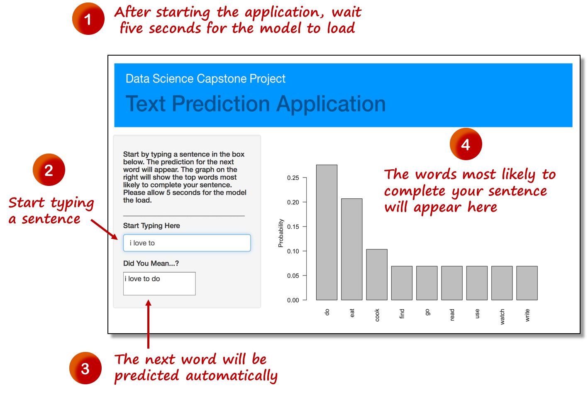

```{r setup, include=FALSE}
knitr::opts_chunk$set(echo = FALSE)
```

## The Goal

This is an R Markdown presentation. Markdown is a simple formatting syntax for authoring HTML, PDF, and MS Word documents. For more details on using R Markdown see <http://rmarkdown.rstudio.com>.

When you click the **Knit** button a document will be generated that includes both content as well as the output of any embedded R code chunks within the document.

## Logic Behind the Application

- Bullet 1
- Bullet 2
- Bullet 3

## User Interface

```{r, out.width = "700px"}

```

## Application Performance

```{r pressure}
plot(pressure)
```

